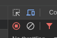

# Solitaire

A solitaire game in React Native using WebGL.

[Play it here!](http://games.delarco.com.br/solitaire)

On deskop, use the Device Mode (need to fix touch/mouse events):

## Screenshots

Game screen

Autocomplete

Win screen

Game over screen

## TODO

* Add loading message
* Fix stock card depth on undo
* Add sound
* Refactor rect collision on drag
* Fix window resize
* Fix touche/mouse events when rendering in browser
* Bundle images

## Resources

* Font: https://opengameart.org/content/sprite-fonts-64x64-abblv-by-raid
* Solitaire score system: https://hands.com/~lkcl/hp6915/Dump/Files/soltr.htm
